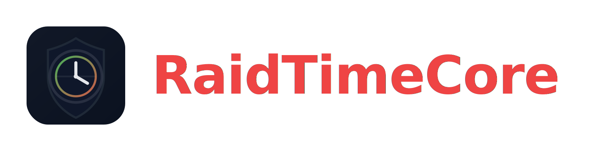

# RaidTimeCore

**Efficient Raid Scheduling System for Unturned**
**Version:** 1.0.1
**Author:** Diarka (@diarka7w8)

---

## Description
RaidTimeCore is a plugin designed to automate Raid and Peace schedules on your server. It handles the timing logic efficiently in the background (using Async/UniTask) to ensure it causes zero lag, regardless of player count.

The system uses a cyclic schedule (e.g., 4 hours of Peace -> 45 minutes of Raid) that keeps running perfectly even if the server restarts.

## Key Features
* **Zero Lag:** Logic runs on background threads to keep the server smooth.
* **Hardcore Security:** Structure damage is blocked at the engine level (Harmony) during Peace time.
* **Smart Schedule:** No database required; the cycle is mathematical and persistent.
* **Multi-Language:** Supports English, Spanish, Russian, and Portuguese (BR).

## Commands & Permissions

| Command | Permission | Description |
| :--- | :--- | :--- |
| `/raid` | `raid.check` | Shows the current status (Peace/Raid) and the time remaining for the next phase. |
| **(Passive)** | `raid.bypass` | Allows Admins/Staff to destroy structures even during Peace time. |

*Aliases for `/raid`: `/time`, `/schedule`, `/tiempo`*

## Installation
1. Download `RaidTimeCore.dll`.
2. Place it in your server's `Rocket/Plugins` folder.
3. Restart the server.
4. Edit the `RaidTimeCoreConfiguration.xml` file to set your preferred times.

## Compilation (Source Code)
* **Requirements:** .NET Framework 4.8.
* **Build:** Open the project and run `dotnet build -c Release`.
* **Dependencies:** All necessary libraries are included in the `libs/` folder.

---
*© 2025 Diarka.* Suport https://discord.gg/qPBEQyBUz7